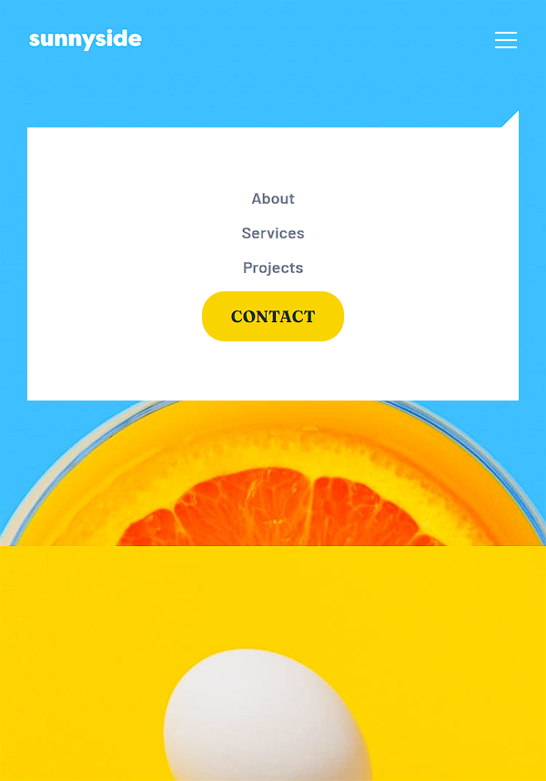

# Frontend Mentor - Sunnyside agency landing page solution

This is a solution to the [Sunnyside agency landing page challenge on Frontend Mentor](https://www.frontendmentor.io/challenges/sunnyside-agency-landing-page-7yVs3B6ef). Frontend Mentor challenges help you improve your coding skills by building realistic projects. 

## Table of contents

- [Frontend Mentor - Sunnyside agency landing page solution](#frontend-mentor---sunnyside-agency-landing-page-solution)
  - [Table of contents](#table-of-contents)
  - [Overview](#overview)
    - [The challenge](#the-challenge)
    - [Screenshot](#screenshot)
      - [Desktop](#desktop)
      - [Mobile](#mobile)
    - [Links](#links)
  - [My process](#my-process)
    - [Built with](#built-with)
    - [What I learned](#what-i-learned)
    - [Useful resources](#useful-resources)
  - [Author](#author)
  - [Acknowledgments](#acknowledgments)


## Overview

### The challenge

Users should be able to:

- View the optimal layout for the site depending on their device's screen size
- See hover states for all interactive elements on the page

### Screenshot
#### Desktop

#### Mobile


### Links

- Solution URL: [Github Repository](https://github.com/huirayj/fm-sunnyside-agency-landing-page)
- Live Site URL: [Deployed Site](https://huirayj.github.io/fm-sunnyside-agency-landing-page/)

## My process

### Built with

- Semantic HTML5 markup
- CSS
- Flexbox
- CSS Grid
- JavaScript

### What I learned

In this exercise, I learned to use the "background" to add background images.

```css
header {
	background-image: url('../images/desktop/image-header.jpg');
	background-size: cover;
	background-repeat: no-repeat;
	background-position: center;
	display: flex;
	flex-direction: column;
	align-items: center;
	height: 85vh;
}
```

In this snippet, the header is given a background image.

### Useful resources

- [background](https://developer.mozilla.org/en-US/docs/Web/CSS/background) - This is an amazing article which helped me finally understand the CSS "background" property
- [background-size](https://cssreference.io/property/background-size/) - Here is another resource on "background", specifically, "background-size".

## Author

- Website - [Justin Hui](https://huirayj.github.io/react-portfolio/)
- Frontend Mentor - [@huirayj](https://www.frontendmentor.io/profile/huirayj)

## Acknowledgments

Thank you, Frontend Mentor for providing this opportunity to practice and learn about Frontend Web Development.
